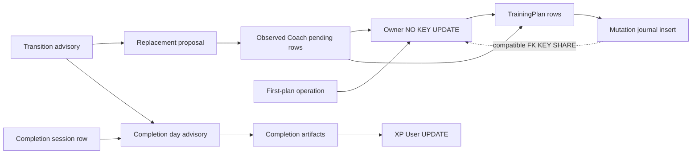

# LP18-B0 transaction foundation

Base: 088d04dc6506adf677d6f77da07db8f660f69382. Main equals discovery.
Open backend PRs 400, 383, 342: no canonical writer/schema overlap; 342 owns
provider adapters. LP16 ownership excluded. No API, AWS, deploy, CI or merge.

## Lock graph evaluated before implementation

Explicit existing edges:
- Browser replacement: User UPDATE -> TrainingPlan UPDATE.
- Direct mutation/undo: TrainingPlan UPDATE -> mutation journal insert.
- Coach confirm: Coach proposal UPDATE -> TrainingPlan UPDATE -> journal insert;
  mutation commits before proposal APPLIED bookkeeping.
- Native first plan: generation operation UPDATE -> User UPDATE -> plan insert.
- Workout start: completion-day advisory -> session insert (snapshot previously
  computed before day lock).
- Completion: WorkoutSession UPDATE -> completion-day advisory -> completion
  artifacts -> User UPDATE (XP), plus quest/challenge/activity writers.
- Generation quota: operation -> User; provider outside transactions; generation
  advisory uses nonblocking try-lock on the single-bigint advisory key space.
- FK inserts (plan, session, proposal, journal, completion artifacts): User KEY
  SHARE. Journal reaches this after TrainingPlan UPDATE.

Rejected: start User UPDATE -> day, because completion day -> User UPDATE makes
an actual wait cycle. Also the existing User UPDATE -> plan UPDATE can cycle
with mutation plan UPDATE -> User KEY SHARE. No new boundary may perpetuate it.

Chosen graph (lock modes matter):
- Native replacement: transition -> replacement proposal UPDATE -> all observed
  PENDING Coach proposal rows UPDATE -> User NO KEY UPDATE -> plan UPDATE ->
  receipt/proposal result writes -> commit.
- Start: transition -> day -> session insert/User KEY SHARE -> commit. Existing
  session reads are unlocked. Snapshot is refreshed after transition authority.
- Coach: proposal UPDATE -> plan UPDATE -> journal/User KEY SHARE -> commit;
  frozen binding must be checked again under the plan lock.
- Browser: User NO KEY UPDATE -> plan UPDATE -> insert/User KEY SHARE -> commit.
- First plan: operation UPDATE -> User NO KEY UPDATE -> plan insert -> commit.
- Completion unchanged: session -> day -> artifacts -> User UPDATE -> commit.

NO KEY UPDATE conflicts with itself and User UPDATE but is compatible with FK
KEY SHARE, removing the implicit plan -> conflicting User edge. Neither User,
plan, session, day, Coach nor generation operation holders request transition.
Replacement never requests day/session. Coach rows precede User/plan; no plan
holder requests a Coach row. Start never requests User UPDATE. Thus each
conflicting edge follows this partial order: transition/proposal/operation;
session/Coach; day; artifacts/User; plan. Completion artifact-only edges do not
return into plan/transition/Coach. XP-only User writers never request day or plan.
Account deletion is an explicit destructive exception outside replacement flow.

Transition identity: PostgreSQL two-int advisory key space, namespace 0x41584918
('AXI' + lane 18), second key trusted positive signed-int owner id. All existing
advisory users use the distinct single-bigint key space (PG distinguishes the
spaces). No hash collision with those domains; no client lock key. Transaction
scoped until commit/rollback; no logging. SQLite no-op supports service tests
only and is NOT concurrency qualification.

## Authorities and schema consumers

`plan_replacement.replace_training_plan_in_transaction` is the sole destructive
mutation implementation. It owns neither commit nor rollback. The browser
`replace_training_plan` wrapper preserves its expectation, return shape, one
commit, rollback behavior, observed-row-only deletion and new lineage/version0.
The native foundation owns the enclosing commit for replacement plus receipt.
A synchronous local `before_replace` guard runs after locked binding comparison
and before deletion. It performs no provider/catalog/network work.

Two new tables, not TrainingPlan operation columns:

| Persisted field | Consumer |
|---|---|
| Proposal `public_id` | Random opaque owner-scoped locator; immutable intent identity |
| Proposal `user_id` | Authorization and account erasure |
| Proposal base lineage/version/exact UTF-8 SHA256 | Final refreshed locked stale precondition |
| Proposal candidate text/score | Exact reviewed candidate copied by the sole canonical writer |
| Proposal candidate fingerprint | Text AND score integrity; frozen confirm intent |
| Proposal created/expiry timestamps | 30-minute review TTL and bounded cleanup |
| Receipt `public_id` | Stable opaque operation/result identity for B1 |
| Receipt `user_id` + domain-separated key digest | Owner-scoped exactly-once confirm authority without raw key storage |
| Receipt intent fingerprint | Versioned immutable proposal/base/candidate/explicit-acceptance binding |
| Receipt proposal public id (soft) | Same-key intent discrimination after proposal deletion; applied-proposal uniqueness |
| Receipt status | Closed immutable terminal result, including refusal replay |
| Receipt result lineage/version | ORIGINAL success, independent of current plan or old lineage lifetime |
| Receipt created timestamp | Retry/support retention horizon |

Integer primary keys are internal ORM identities. No plan FK or proposal FK on
receipts: replacing/deleting plans or deleting expired sensitive proposal content
cannot cascade away replay evidence. Both tables have only owner CASCADE FKs,
and both are registered in explicit account purge. No preferences, prompt,
generation context, command payload, plan snapshot, exercise list or raw key is
stored in the receipt. Candidate bytes are capped at 256 KiB by the staging
service; schema caps characters as an additional bound. No consumer for a
separate generation ledger exists in B0. B1 must supply admission, candidate
validation/projectability, generation idempotency and provider recovery before
calling the trusted staging primitive.

Proposal is immutable after staging, enforced for ORM updates. Its derived state
is READY until expiry, CONSUMED once an APPLIED receipt exists, otherwise EXPIRED.
It has no mutable confirmation status or copy of the receipt. Candidate text,
score, binding and locator never get regenerated/rebound. Expensive generation
and validation happen outside these primitives and their locks. No HTTP route
or provider adapter imports this package yet.

Migration `e3f4a5b6c7d8`, parent `e2f3a4b5c6d7`, declares
`expand_contract = "expand"`. New table definitions carry their own constraints,
including conditional one-APPLIED-receipt-per-proposal uniqueness. They do not
restrict any previous serving-revision writer. Existing-table reruns verify
columns/types/nullability, owner cascade, unique constraints, check identities,
indexes and the conditional uniqueness predicate. No drops/backfill/renames or
existing-table alterations. Downgrade deliberately refuses to erase authority.
One Alembic head; R6 checker passes. Model-only boot and migration-created schema
are both tested on PostgreSQL.

## Closed confirmation state machine

There is no durable PENDING confirmation. The short PostgreSQL transaction
claims the missing owner/key under transition authority and creates one terminal
receipt. A rollback leaves no admitted key. There is no resumable provider work
inside confirmation, so FAILED/CANCELLED/PENDING states would add no useful
recovery semantics. Cancelling review calls no confirmation primitive.

| Predecessor -> durable terminal result | Transaction owner / plan effect | Replay |
|---|---|---|
| No receipt -> APPLIED | confirm; exact locked binding, no ACTIVE, no locked pending Coach; sole replacement plus receipt in one commit | Original receipt/lineage/version0, even after subsequent replacement or proposal deletion |
| No receipt -> STALE | confirm; missing/current lineage/version/digest mismatch; zero plan write | Same durable refusal |
| No receipt -> ACTIVE_REFUSED | confirm; ANY owned ACTIVE column row; zero plan/session write | Same refusal; new key after explicit session resolution may retry proposal |
| No receipt -> COACH_PENDING_REFUSED | confirm; observed pending Coach row locked before owner/plan; zero plan/Coach write | Same refusal; fresh key after Coach resolution may retry proposal |
| No receipt -> EXPIRED | confirm; immutable TTL elapsed; zero plan write | Same refusal |
| No receipt -> CONSUMED | confirm; proposal already has a successful receipt; zero plan write | Same refusal |
| Existing receipt + same immutable intent | confirm read transaction rolled back; zero write | Terminal original result |
| Existing receipt + different intent | typed ConfirmationConflict; rollback; no new receipt/plan | Conflict |
| Missing/wrong-owner proposal or corrupt candidate | typed ProposalUnavailable; rollback; no admitted key | Fail closed |
| Infrastructure fault before commit | rollback all plan/receipt writes | Same key safely retries |
| Commit succeeds but response lost | committed receipt remains authoritative | Same key returns original result |

Terminal receipts cannot transition or update. A refusal consumes its confirm
key, not the proposal; an ACTIVE/Coach conflict must not misleadingly replay as
success after the world changes. A fresh confirmation key is a fresh acceptance
attempt. Original successful key always replays before TTL/current-plan/session
checks. Its soft proposal id is sufficient after candidate deletion because
server-minted proposal identities are never reused and their intent is immutable;
while the proposal exists, replay additionally compares the frozen fingerprint.
No replay calls a provider or the canonical writer. B1 will map these domain
classes/results into native envelopes and require the literal confirmation flag.

## Coach coordination and creation race

Existing Coach confirmation retains proposal -> plan ordering. Its early binding
check is now supplemented by `expected_binding` in the canonical mutation/undo
service, comparing all three fields after its refreshed plan lock, before any
write. Replay still uses the original mutation journal. No unbound direct
mutation semantics change. Replacement locks observed pending Coach rows before
User/plan. A Coach winner changes binding, so replacement refuses STALE; a
replacement winner holding a pending row refuses without cancelling/applying it.
Coach's existing post-mutation APPLIED bookkeeping may briefly leave PENDING;
replacement does not reinterpret or resolve it.

New Coach proposal creation need not join transition authority: it does no
canonical write and provider work stays outside the transaction. Its User FK
KEY SHARE is compatible with replacement's NO KEY UPDATE. A proposal staged
from the old preview after replacement's pending scan may persist, but its old
lineage/version/digest cannot confirm against the new row. PG tests retain the
same exercise target across replacement, so absence of a target cannot mask a
missing binding check; canonical confirmed mutation refuses, then the actual
Coach confirmation path marks the proposal STALE. No ambiguous double success.

## Retention contract and deferred cleanup (P2)

Proposal review lasts 30 minutes. Future cleanup deletes expired/consumed
candidate rows after a 24-hour grace, retaining successful confirmation authority
separately. Successful and refused receipts retain owner/key/frozen intent/result
for a **90-day maximum legitimate confirmation retry and support horizon**.
B1 must document that horizon before launch; support procedures must use it too.
No receipt is deleted within it. Receipt replay does not depend on proposal TTL.

A future bounded batch worker first removes expired proposal contents/rows, then
receipts older than the horizon, using expiry/created indexes and small batches.
It must never revive a proposal or regenerate under its old locator. After the
horizon, an original old proposal is expired or absent: its confirmation fails
closed and cannot replace again, even after its receipt is collected. Original
result replay is guaranteed within the advertised horizon; outside it the
original result is unavailable, with no canonical write. Reusing an old key for
a new proposal outside this horizon is a new operation, not a legitimate retry.
Account deletion erases both tables immediately. Scheduling this cleanup is P2,
per the task's authorization to defer it at initial launch volume; enabling it
and publishing the horizon are B1 launch requirements, not indefinite retention.

## Qualification

Events only place the forced windows. The tests use independent PostgreSQL
connections at READ COMMITTED and inspect `pg_blocking_pids` to prove the second
writer actually waits. Bounds terminate failures; no deadlock/lock timeout is an
accepted outcome. Completion can progress through XP while start holds transition
before day. Start waiting behind completion day/User releases only after the
canonical completion, then refuses. An uncommitted linked completion may produce
conservative ACTIVE refusal, preserving all session/artifact state.

The numeric single-bigint key is deliberately matched to the bits of the chosen
two-int transition key in a PG test: both can hold concurrently. This proves
namespace identity separation rather than relying on a hash collision argument.
Missing PG is not graded as a pass. SQLite qualifies sequential domain behavior
only. Existing browser-with-ACTIVE behavior remains deliberately unchanged.

Mutation evidence is bounded metadata (detector, exit, assertion verdict), never
raw pytest object representations containing proposal/key/binding values.
M1 and M2 run actual forced PG races. M4/M13/M14/M17 are architectural assertions;
other mutants have durable state/refusal/replay/fault oracles. All source edits
are restored after each run; no CI/PR has been triggered.

The artifact branch includes challenge progress UPDATE/savepoint -> reward User
UPDATE, quest-progress FK/insert -> quest XP User UPDATE, and base XP User UPDATE.
`award_xp` subsequently writes the separate `xp_earned` challenge progress rows;
reward XP uses `count_challenge_xp=False`. A reward's second User acquisition is
reentrant in that transaction, not an additional wait edge. None of these
artifact writers requests transition, proposal, plan or completion day after
User. Both forced orders also run with pump/workout/XP challenges and a daily
quest actually reaching their reward threshold; all three challenge completions,
quest claim and exact XP total must survive (a swallowed savepoint failure cannot
qualify as success). Existing gamification semantics and logging are unchanged.

The dashed edge cannot block the owner NO KEY UPDATE holder. Reentrant User
locks and compatible FK locks are not conflicting wait edges. The solid
ordering has no return path to transition/day/proposal/plan from XP artifacts.
The graph concerns the requested training transitions, not administrative
account destruction or a global claim about every unrelated app writer.

## Final local evidence and handoff

- Focused domain/browser/session/Coach/architecture/account-purge checks:
  **433 passed** (`evidence/lp18-b0/focused-tests.txt`).
- Migration upgrade/rerun/shape/single-head/R6 checks: **100 passed**
  (`evidence/lp18-b0/migration-tests.txt`), plus migration-created PG schema.
- New forced-order foundation PostgreSQL matrix: **21 passed**
  (`evidence/lp18-b0/pg-foundation-tests.txt`). Existing replacement/Coach races:
  **23 passed** within the combined 41-test run; existing workout-session,
  first-plan and mutation-history PG regressions: **20 passed**. Thus **64
  distinct PG tests passed**, no skipped qualification cases. The three final
  Coach cases also passed through the actual authorized tool path.
- LP18 architecture assertions: **4 passed**, with existing guards included in
  the focused result. Exactly one replacement implementation, transaction scope,
  provider absence, lock order/mode/namespace and route/privacy/isolation guards.
- **17/17 mutants killed by assertions**, M1–M17 in `evidence/lp18-b0/mutations.json`.
  M1 transition removal; M2 pre-lock snapshot; M3 ACTIVE omission; M4 owner-before-
  day; M5 inner replacement commit; M6 missing semantic fingerprint; M7 changed-
  intent replay; M8 second replacement on replay; M9/M10/M11 digest/version/
  lineage omission; M12 Coach pending omission; M13 plan-before-Coach inversion;
  M14 executable synthetic provider call under transaction; M15 expiry omission;
  M16 consumed-state omission; M17 conflicting owner UPDATE mode. No import error,
  skipped PG, timeout or deadlock is counted as a kill.

P0=0; P1=0; P2=1 (deferred bounded retention worker and advertised replay horizon
before B1 launch); P3=0. LP16 and mobile runtime untouched. No native replacement
routes added. No AWS, production, deploy, merge, PR or CI. Local branch:
`lp18/b0-replacement-transaction-foundation`. Main rechecked at the same base.

**LP18_B0_STATUS=READY_FOR_REVIEW.** The implementation is local and committed;
the exact HEAD SHA is returned with the handoff. Next task is LP18-B1 native
replacement proposal + confirm API. HOLD.
